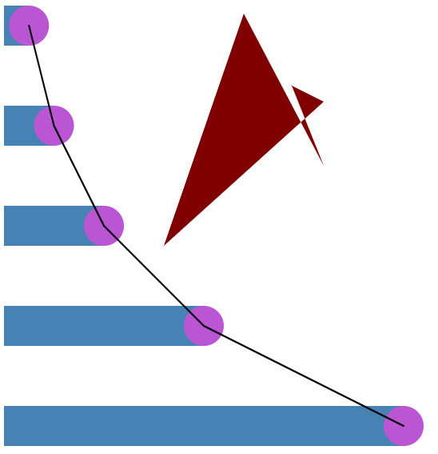

Assignment 1 - Hello World: GitHub and d3  
===

See: https://nyoma-diamond.github.io/01-ghd3/index.html

For the assignment, I created a horizontal bar graph representing the exponential growth of the equation 2^x. To show another way of visualizing this exponential growth I also created line chart, underneath which is filled using a polygon.

This is a screenshot of the visualization:

For the line chart I used https://observablehq.com/@d3/line-chart as a reference to figure out and understand how lines work in D3.

You'll see I tried to get the circles to align with the bars to cap them off smoothly. My hope was that this would make the image look just slightly cleaner while also giving me something functional to do with the circles. I also made sure to create the polygon *before* the line so that the line would be more visible (otherwise the polygon would render on top of the line, hiding part of it).

This has also been coded such that you may enter to what power you want to take 2^x to, so while my screenshot only shows up to 2^5, you can try up to as high as you want (though at higher values the bar graph will stop looking so good as the bars will overlap since their width is hard-coded).
