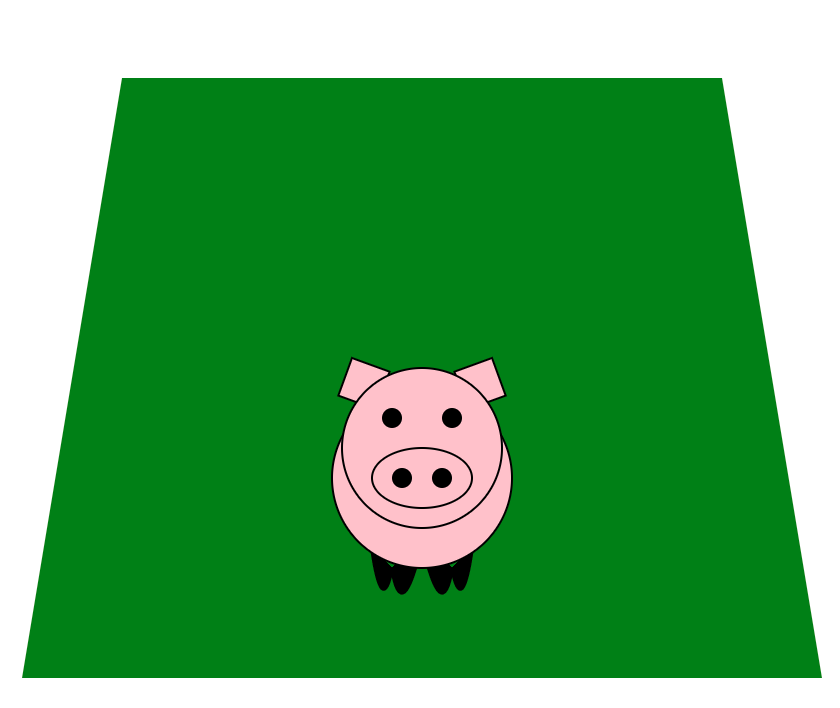

Assignment 1 - Hello World: GitHub and d3  
===

In this code I generated a pig using graphics primitives:

http://nshedd.github.io/01-ghd3/index.html

Required elements
===

I used circles and ellipses for the head, body, snout, and eyes
I used rectangles for the ears
I used paths/lines to create the hooves
I used a polygon to create the graph

Design achievement
===

I made a cute pig from all of the required elements.

Technical achievement
===

I added animation to create a moving snout so the pig appears to be oinking

Code and resources used
===

I just used to code from lecture, documentation of how to generate each shape, (and lots of trial and error) to create the image. It is almost entirely original
