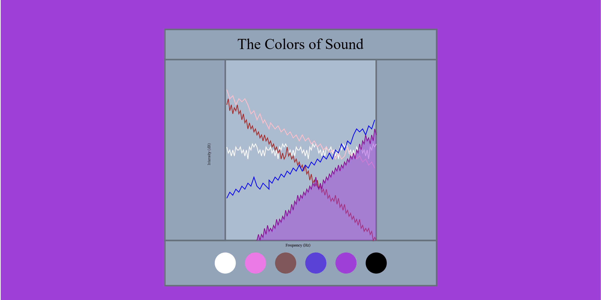
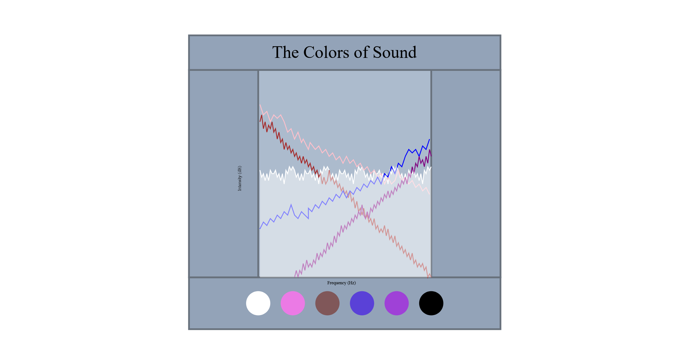

Assignment 1 - Hello World: GitHub and d3  
===
Rachael Sallie

GH-Pages Link: https://resallie.github.io/01-ghd3/

I created a webpage demonstrating different 'colors' of sound, including white noise, pink noise, brown noise, blue noise, purple noise, and black noise(silence).
The graph shows the relative differences in the intensities of each frequency for each color of noise. The lines are relatively to each other and not based on actual data, 
so I did not include specific units on the graph, so it would not imply that these lines match up to actual measurements. Sounds are mostly from https://en.wikipedia.org/wiki/Colors_of_noise , with this addition source used for an mp3 of silence: https://bigsoundbank.com/detail-0917-one-minute-of-silence.html. 

Technical Achievements:

- I made the website interactive with clickable buttons of different colors, that affect the webpage in multiple ways (background colors, polygons, and sounds).
- By editing an audio element, I learned how to attach sound to buttons.

Design Achievements:

- By sizing elements based on percentages, my webpage scales nicely to different screen sizes, making the webpage accessible for various devices.
- With both the background changing color, and the area below the relevant line filling in with color, it is easy for the user to recogizine which color of sound they are
  currently listening to.
- Hovering over a circle with your mouse changes the opacity, providing an indicator to the user that the circle is clickable.

