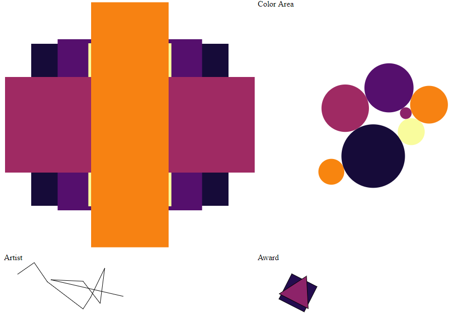
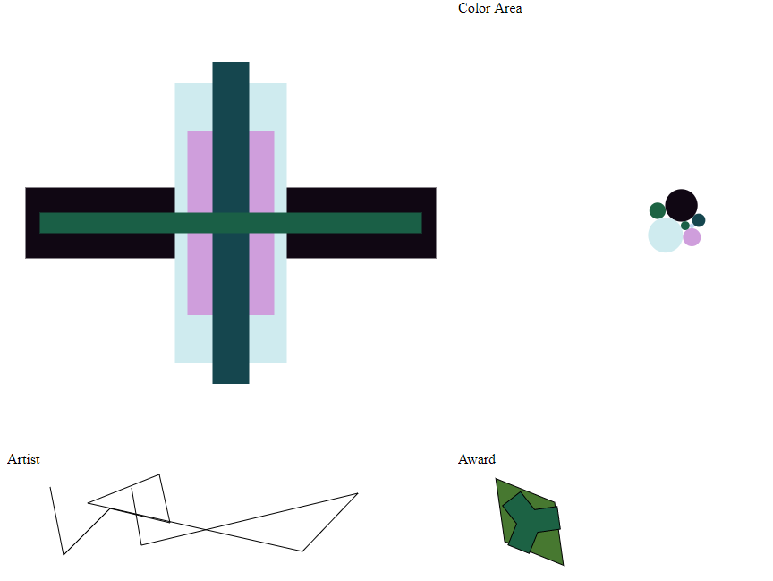
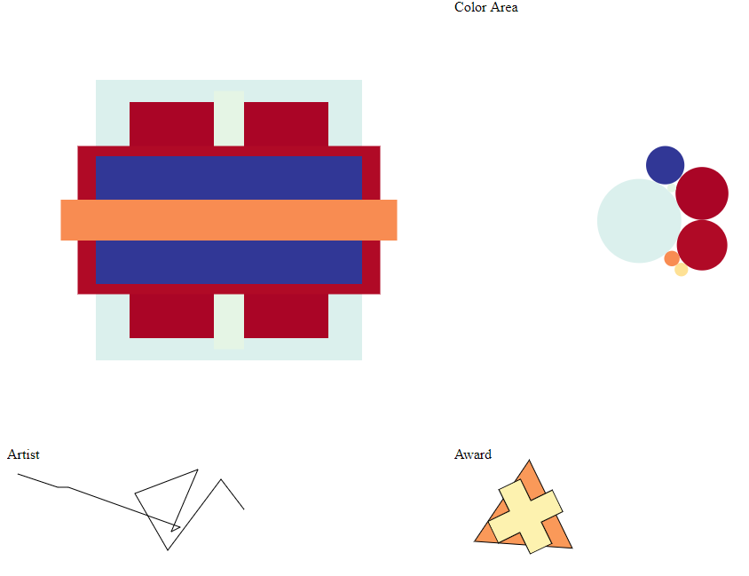
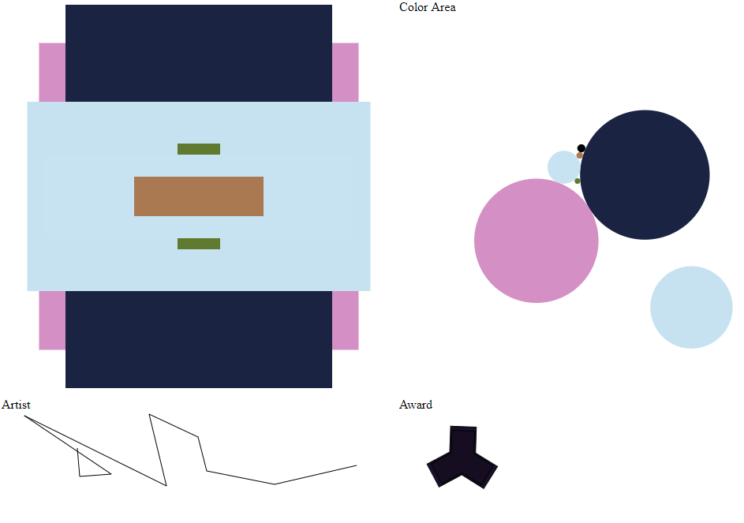

Assignment 1 - Hello World: GitHub and d3  
===
github-page: <a href="https://fish1natank.github.io/01-ghd3-1/" target="_blank">Home Page</a>

Lamp Simulator: <a href="https://fish1natank.github.io/01-ghd3-1/LampSimulator.html" target="_blank">Play here</a>

---

Description
---
Welcome to Lamp Simulator!

Controls:
 - Create new Lamp: click the “Update” button or press “X” on the keyboard.
 - Change color Scheme: click the “Color Scheme” button or press “C” on the keyboard.

I used random squares to create lamps. These use transitions when generating a new lamp. An area color chart is generated from the seven lamp squares. The circles collide and are pulled towards the center using forceSimulation. When drawing random lines, I thought it kind of looked like a signature. The line is gently pulled to the right so that it looks more like a terrible handwriting. Finally using symbols to create a small award.

---

Lamps
---
### Inferno Lamp

### CubeHelix Lamp

### RdYlBu Lamp

### IMPOSSIBLE Lamp

---

Technical Achievement Description
---
Transitions, force simulations, and random data (IT’S ALIVE!!!).

Transitions turned out to be quite simple after wrapping my head around D3’s Enter, Update and Exit sections. These transitions whet my appetite for interactions between elements and I started looking it forceSimulation. Turns out transitions and collisions can only execute one at a time, so I couldn’t get circles to collide while changing their size (at least not yet). After a while I had squares that could transition and circles that would collide, however I wanted them to relate to one another. I decided to use the random squares to generate area data for each color represented in the Lamp and used this to set the circle size before the force simulation. The result was an area color chart using colliding circles corresponding to the random squares in the Lamp.

---

Design Achievement Description
---
Use of color scales.

As fun as random colors are, it is nice if they don’t look horrible next to each other. An easy solution to this it to use a color scale, and D3 has a lot of them (<a href="https://github.com/d3/d3-scale-chromatic" target="_blank">d3-scale-chromatic</a>). I made a ColorManager class that holds an array of selected color scales, and a way to change the color scheme index. Now anytime I wanted a color I would just have to ask the ColorManager and no mater what scheme was used I knew the colors would look better than average.

---

Code Refrence
---
D3 in Depth

Transitions: 	<a href="https://bl.ocks.org/d3indepth/16c3036242d93526f3e18c60266b154e" target="_blank">bl.ocks.org Transitions</a>

Force:		<a href="https://bl.ocks.org/d3indepth/9d9f03a0016bc9df0f13b0d52978c02f" target="_blank">bl.ocks.org Force</a>

Lines:		<a href="https://bl.ocks.org/d3indepth/dd0e2e52b32f5c646b75acdfcb46864e" target="_blank">bl.ocks.org Lines</a>

Symbols:	<a href="https://bl.ocks.org/d3indepth/bae221df69af953fb06351e1391e89a0" target="_blank">bl.ocks.org Symbols</a>
