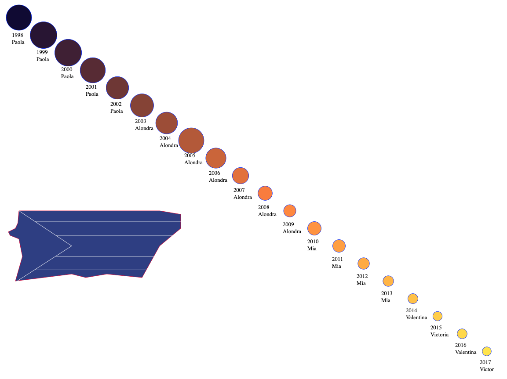
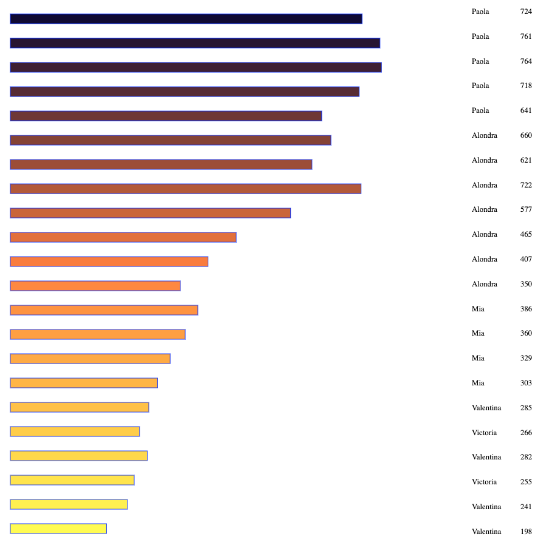

Assignment 1 - Hello World: GitHub and d3  
===

a1-your Gh username-your first name-your lastname

Link to gh-pages: https://alvaradoblancouribe.github.io

This project visualizes the most popular names in Puerto Rico from 1998 to 2017, using this dataset (https://www.ssa.gov/oact/babynames/limits.html). 

The title of the page is created by using textpath and is inspired by the SVG documentation on text path (https://developer.mozilla.org/en-US/docs/Web/SVG/Element/textPath). 

The circles are directly proportionate to the number of people with the name below the circle. As the circles' x and y coordinates increase, so does the RGB values of the circle. 

Below the diagonal line of circles, there is a polygon in the shape of the mainland of Puerto Rico with the use of lines to create the outline of the flag on top of it (without the star)

Below the polygon, there are a set of rectangles that show the number of people with each name in a different way. Like the circles, the position of the rectangle influences the color that it is. 

Technical Achievement Desription
- I downloaded the data from this website(https://www.ssa.gov/oact/babynames/limits.html), changed it to an appropriate csv format, filtered it's contents in script.js to only use the most popular names per year, and used that data to create the shapes and influence their colors. 

Design Achievement Description
- I created the outline of Puerto Rico and its flag (without the star) with the polygon and lines svg
- I played around with text, manipulating the DOM to make text from the database show up, and had an interesting creative way to display the title (makes me think of the Dr.Seuss books)

