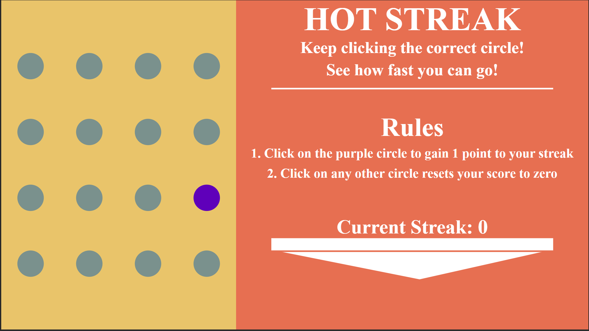

Assignment 1 - Hello World: GitHub and d3  
===

Project Submission
---
[Link to my project site on GH Pages](https://lucasfernandes.dev/cs480x-Assignment1/)

Some of my favortie visualizations I've seen online over the years rely heavily on discovery and interactivity. I felt the best way to start learning D3 was to focus on this aspect of design. For this project I developed a game called Hot Streak that challenges the player to click the randomly selected circle in order to keep building a streak. If the player selects any other circle their streak resets and they have to restart it.

In order to meet project specifications I created the 4 by 4 array of circles using D3's ability to bind data to generate scalable elements. Thinking ahead to ways I could iterate on the project I would be able to generate variable dimensions for the array using my current method for creating rows using the modulo operator. I view implementing this array of circles as my techincal achivement and as for design achivement I worked to have most of my elements use viewport scalable attributes such as percentages and viewport values(vh and vw). Additionally the layout of the page is using flexbox.

Below is a screenshot of the project site:

For this project I utilized tutorialspoint D3.js found [here](https://www.tutorialspoint.com/d3js/d3js_introduction_to_svg.htm) to learn and begin working in D3 in order to create the primative shapes on my project site. I otherwise reffered to stack overflow for miscellaneous JS syntax issues.

