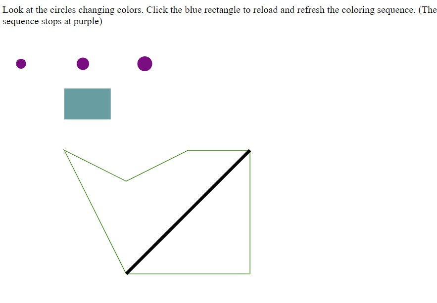

Assignment 1 - Hello World: GitHub and d3  
===

This is a starting project to make sure you can write and host a webpage that generates graphics using d3. 

The primary goal is to be able to generate graphics primitives (circles, rectangles, lines, polygons) at different locations on the screen with different colors. 

The secondary goal is to introduce you to coding on GitHub, including creating a gh-pages branch to host your visualizations.

Live Updating Site:
https://truongshan.github.io/01-ghd3/index.html

Tutorials used:
https://bost.ocks.org/mike/circles/
https://bost.ocks.org/mike/transition/

In this creation, it is a basic graphic utilizing graphic primitives. These primitives are generated at different locations on the screen with varying colors. 
Additionally, the blue rectangle acts as a button and has a mouse event in which when clicked upon, it reloads the page to go through the color sequence of the three circles.
These creations were based upon the tutorials listed in which I learned the basics about data binding as seen in the source code. I also learned more about the formatting and layout of the graphics using d3 capabilities also seen in the code. Finally, I learned about the different attributes associated with the graphic primitives and the basic code structure.

Technical/Design Achievement
===

The design achievement in this project was done with the color transition changes in the three circles. It was done utilizing the basics that introduced in the tutorial with the three circles. The design achievement shows the transition of colors sequentially.

As for the technical achievement, this was done with the transition button in order to restart the transition of colors. The button itself reloads the webpage and graphic to restart the color sequence once the user initiates the click event. 

It is important to point out the commented code at the bottom of the file. This code isn't functioning and it is unclear why. The purpose of this was to create a line in which the user would be able to select and drag. The selection would be registered. While looking in multiple places and various sources to find out the bug in my code, it is still unclear why the dragging option is not functioning. Further research was attempted in order to try to explore more about d3 and learn more about its capabilities. 

This is one of the many sources I looked into for debugging of the code. This link was provided on the d3 github.
https://observablehq.com/@d3/circle-dragging-ii
