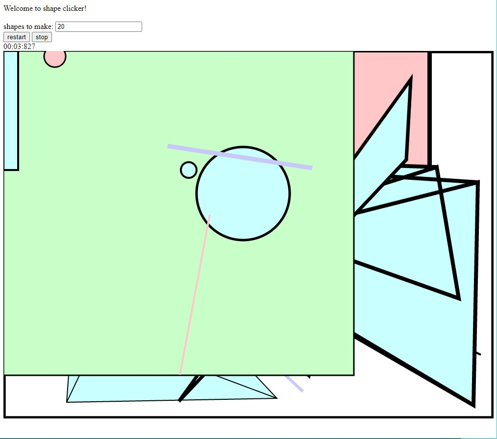

Assignment 1 - Hello World: GitHub and d3
===
Project By: Benjamin M'Sadoques  
For CS480x  

For assignment 1 I created a simple game that uses d3 to make shapes and control a timer. 

It's called "Shape clicker!", a skill based, browser based, clicker game.

Select how many shapes you want to click (default is 10) and click start. 
The shapes can be lines, rectangles, circles, and polygons. 
The shape settings, placement, and colors is different every game.

You can click restart to replace the shapes and re-start the timer.

You can press stop to stop playing.  

Below you can see a typical game session.

I also included a video in the Resources folder to demonstrate the game.  

Pages URL: https://bgmsadoques-wpi.github.io/01-ghd3/

Technical Achievements
---
The technical achievement for this project is the game and timer system. 
I decided that a timer was the best way to score players, rather than a points based system.

The timer was created using d3. It starts when the user presses the start button.
The reset button starts the timer over, and the stop button stops the timer. 
When all the shapes have been clicked, the timer stops to show the player's time.
If there are no shapes, the timer never starts.

Design Achievements
---
The design achievement for this project is the shape generation. 
I wanted to make this game simple to play, but difficult to get a good time on.
With the random shape generation, players cannot memorize where shapes are. 

The shapes have a pool of colors to pick from.
this choice makes seeing the shapes easy. 
I wanted the colors to be calm and not overly bright.

The easy (to click on) shapes are the polygons and rectangles. 
They can generate extremely large but often hide other shapes.

The medium shapes are circles. They generate with a radius from 10, 100.
Some are easy to click on, but others are tiny.

The hard shapes are lines. They generate with a stroke width from 2, 10.
So they can be difficult to click on quickly.
