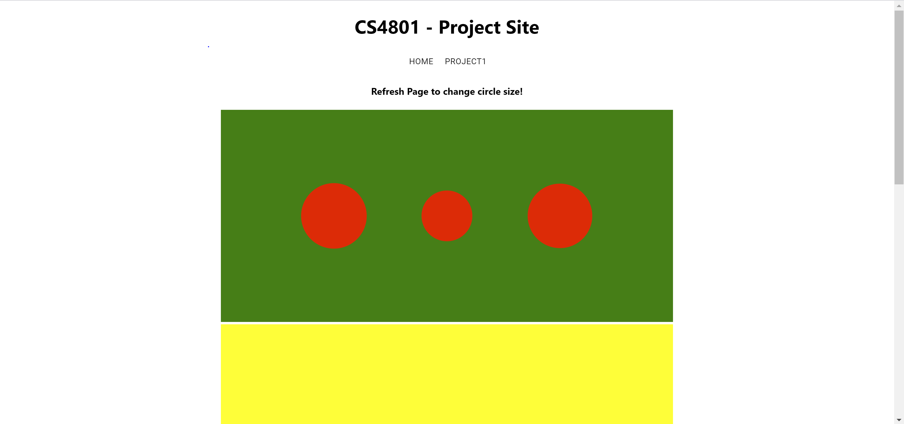
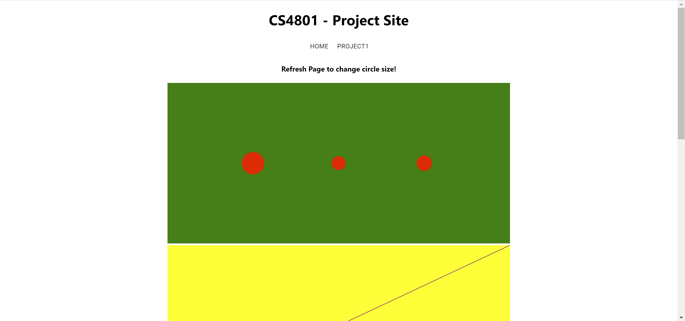
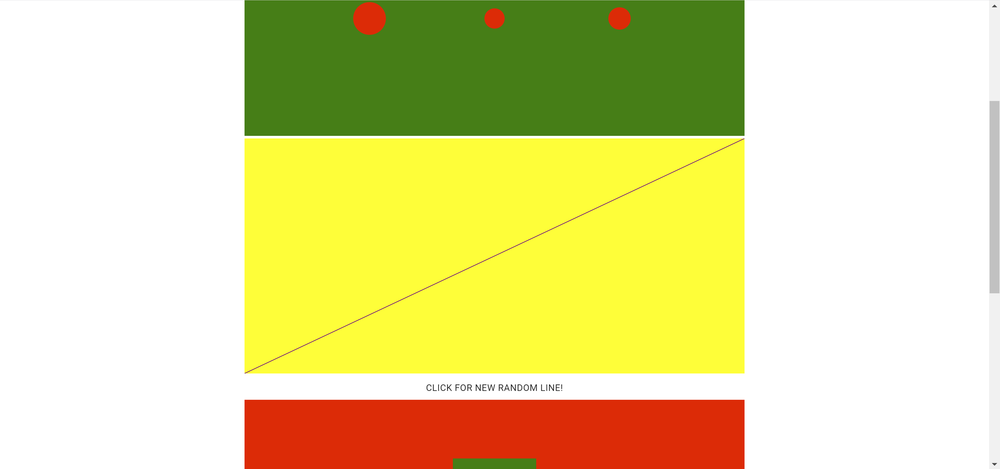
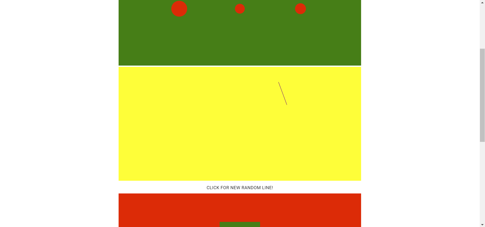

<h1>Live Link: </h1><h3><Link>https://krhodes-cs4802.herokuapp.com/project1</Link></h3>

<h1>Project Description</h1>

    In project a1, I have created a react.js webapp that is hosted on heroku. On the project1 
page of this app I have made 4 react components to create svgs and then populate them using 
d3. The four components I made each correspond to a project requirment (Rectangle, Circle, 
Polygon, Line, Color). The circles use a function to randomly choose a radius, and selects 
the circles by a tag that they have set. 

    The line d3 render also incorperates a button which then uses d3 to select the line and create 
random start and end points within the container.

<h1>Technical Achievement Description</h1>
    To go above and beyond with the technical achievement I did this project inside of a react app.
I chose this for two reasons, the first being that I spent some time over break learning how
o use react.js along with Django to have a dynamic react server to load the database created with 
django. By doing this project in react I can extend my perosnal website to include content from this
classes projects. This will also help with future assignments, as my other projects can extend this 
react app and serve as a portfolio for my classwork. In addition, hopfully I will figure out hosting 
the django server and be able to load database information into some d3 visualizations in future projects.

<h1>Design Achievement Description</h1>
    To improve the design of my project I tried to seperate areas of concern for grading by seperating different
visualizations both in graphically on the page, but then in code via different components as well. I tried to
use contrasting colors in the visualizations to make them easier to see as well! In order to maintain a good 
spacing and a reactive sizing of elements I used react to obtain the window size so I could scale visualizations
for mobile or desktop viewing.

