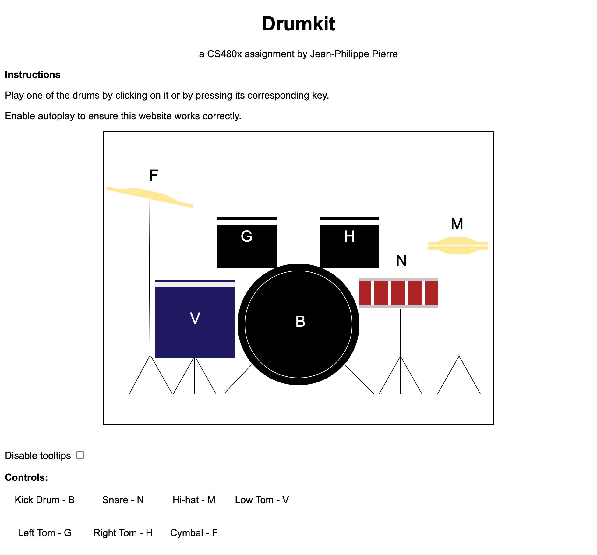

Drumkit: CS480x Assignment 1 by Jean-Philippe Pierre
===

Drumkit is a drum set that a user can play in their browser. The web application displays a drum set consisting of a kick drum, two tom-tom drums, a snare drum, a hi-hat, a floor tom, and a cymbal. Users can play the drums by clicking on them or by pressing their corresponding keys. The key bindings for each drum are:

* Kick drum: B
* Left Tom-tom: G
* Right Tom-tom: H
* Snare drum: N
* Hi-hat: M
* Floor Tom: V
* Cymbal: F

Link to the webpage: TODO: INSERT LINK HERE

## Technical Achievements
* Animations that occur when a user plays each drum. Because the drums often contained numerous SVG elements, SVG groups were used to animate entire drums. d3's transition feature was used to to scale and rotate the drums.
* Users can play the drums by clicking on them or by pressing keys. An event listener was used to respond to key input.
* Used a checkbox, an SVG group, and an onclick listener to implement a tooltip feature that the user can toggle.
* Used Javascript's HTMLAudioElement API to play sounds when drums are played.

## Design Achievements
* Animating the drums when the user plays them was a design choice to let the user know which drums are being played.
* The tooltip feature was implemented to make it easier for users to learn how to play the drums. They are enabled by default so that new users can learn how to play the drums.
* The tooltips can be turned off in case the user does not want to see them.
* The layout of the key bindings is similar to the layout of the drums on the screen. This is to make it easier for the user to learn how to play the drums.
* To let the user know that they can play the drums by clicking on them, the mouse cursor changes to a pointer when the user hovers over the drums.
* The cymbal is animated differently from the other drum equipment to imitate the movement of a real cymbal.