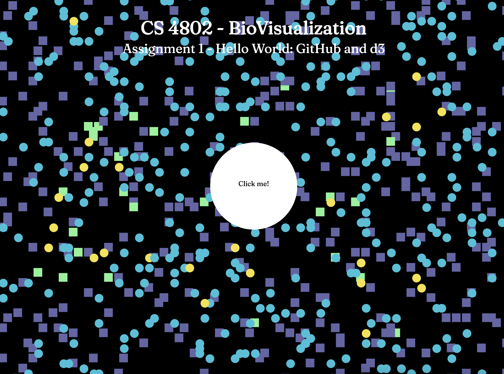
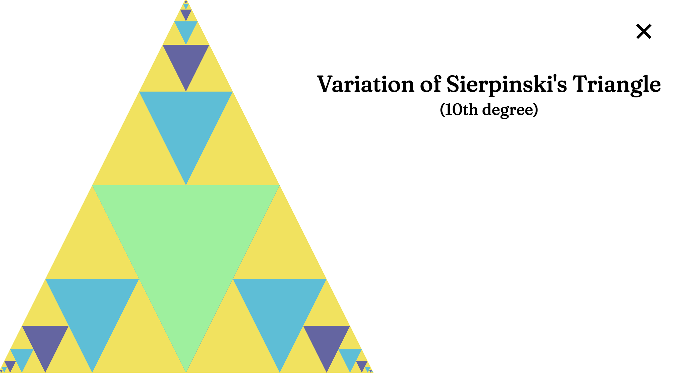
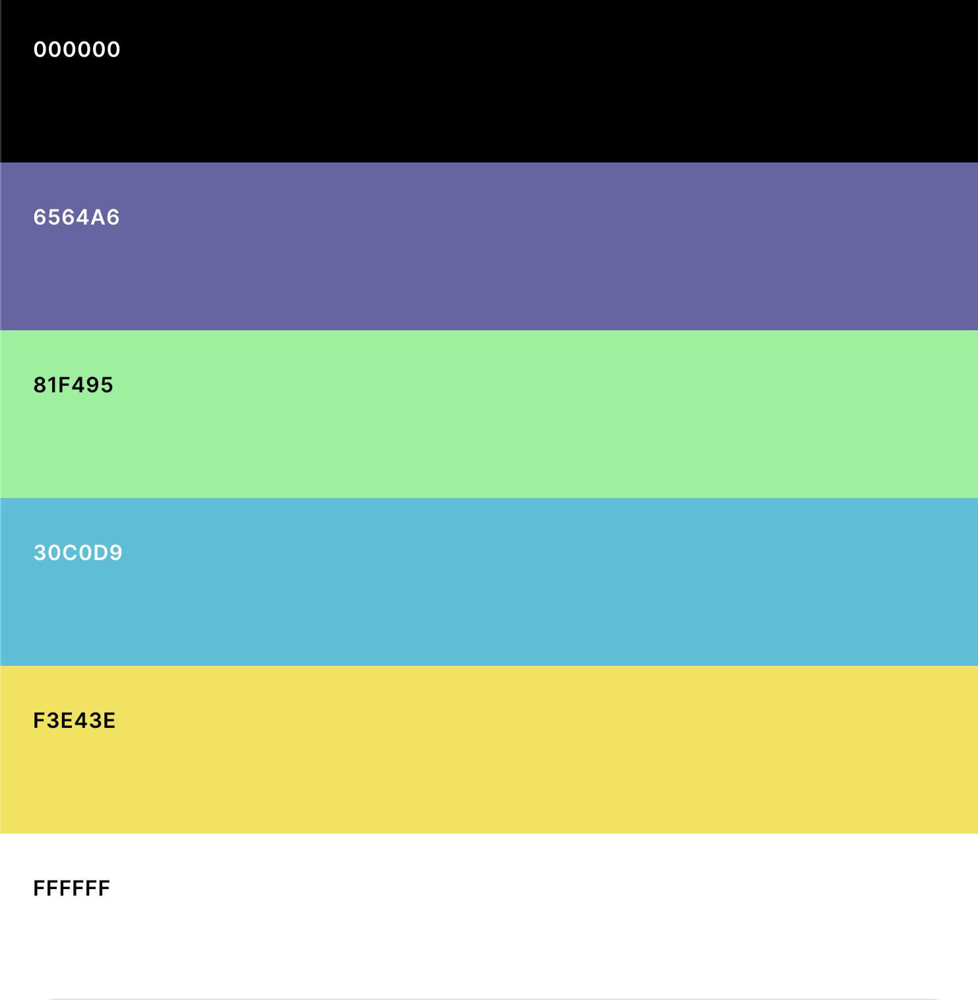

Assignment 1 - Hello World: GitHub and d3  
===

Live Site
==
http://MollyWirtz.github.io/01-ghd3/index.html

Project Description
==
This project served as an introduction to the d3 library, as well as using GitHub pages. It allowed me to explore various features of d3, including animations, interactive elements, and grouping SVGs. 

This site consists of two 'pages', which are made using <g> elements to group SVGs and toggling opacity. The first page contains circle and rectangle primatives, both which are placed randomly around the page and responds to mouseover events by changing color. Also on the first page are a title, subtitle, and a large center-positioned circle with the label 'Click Me!'. 

The second page is transitioned to on click of the center circle, which triggers a wipe animation. On this new screen is a variation of the Sierpiński triangle, along with two more titles and an exit button in the top left corner. The triangles, which fulfill the polygon requirement, appear in one direction at a time down to the 10th iteration. The exit button, which fulfills the line requirement, returns to the first page. 

Technical and Design Achievements
==
<b>Technical Achievements</b>
- Included user events such as mouseover and click to trigger animations and  styles
- Used various animations to smoothly transition between different parts of the project
- Explored and leveraged <g> elements to group svgs, and display different elements based on user location
- Created a fractal using polygons theoretically capable of displaying any number of iterations (change variable numIterations on line 22 to test if desired)

<b>Design Achievements</b>
- Created and applied a color palette for enhanced appearance and user experience
- Designed a unique variation of Sierpiński triangle, a well-known fractal design  

