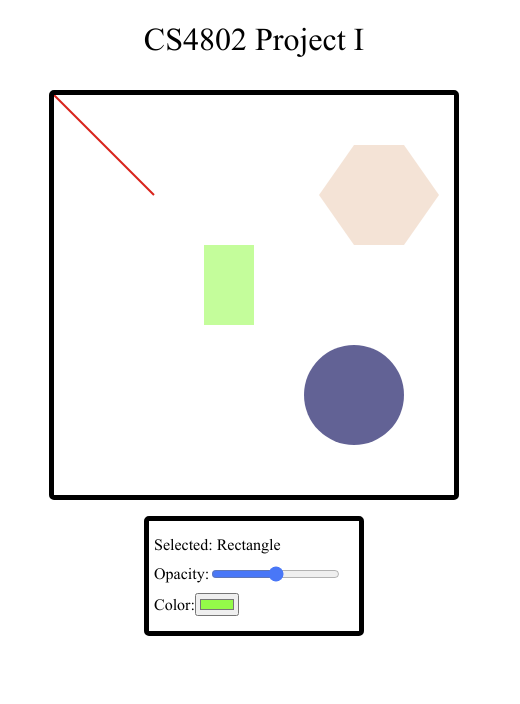

Assignment 1
---
This assignment submission consists of a basic SVG display of four types of shapes:
* Line
* Rectangle
* Circle
* Polygon

In addition, there is interactivity in that the user can select a shape and modify it. 

A live version can be seen here: https://dgcole.github.io/01-ghd3/

This is what it looks like in action:

Technical Achievements
---
The major technical achievements are as follows:
* Allowing the user to click on a shape to select it
* Displaying the type of shape
* Displaying the current opacity and allowing the user to modify it
* Displaying the current color and allowing the user to modify it

Design Achivements
---
The major design achievements are as follows:
* Centering everything on the page and placing the sections (Title - Image - Info Box) in clearly delineated boxes
* Providing a slider for the user to modify the opacity with (slider is most intuitive option here)
* Providing a color picker for the user to visually see the color they are selecting