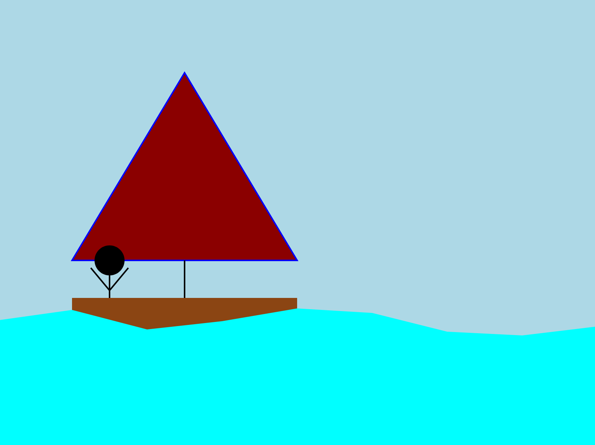

# Jason Dykstra CS 4802 Assignment 1

This is my submission for homework assignment 1 in CS 4802 - Biovisualization.

## What I Have Created
In this very complex web page, I have utilized D3 to create some basic shapes. On this page you will be greeted by (who I like to call) Dominic, sitting on his humble sail boat at sea. While Dominic may not be able to afford the most sophisticated sailboat, he enjoys his `lightcoral` colored sail. The hull of the boat is a mere `saddlebrown` rectangle with a polygon sail attached by a single line. Dominic himself is made of `stroke: black; stroke-width: 2px` solid lines, and the ocean around his two-dimensional boat is a path created by an area generator.

A live page of this award-winning creation can be found [here](http://jasondykstra.github.io).

## Technical And Design Achievements
After overcoming the initial shock of awe, you may notice that you can hover over Dominics sail and turn the outline `blue`. This normally is an indicator that you can click on it and something will happen, right? Well have no fear, clicking on this sail will not only change the color from `lightcoral` to `red` but Dominic will be so overjoyed that your cursor paid him a visit that he will lift his arms up in the air! 

You can feel free to click on his sail as many times as you want, his arms will never get tried as he works out often.

Here are some images to depict the greeting screen, as well as what happens when you click on Dominics sail:

