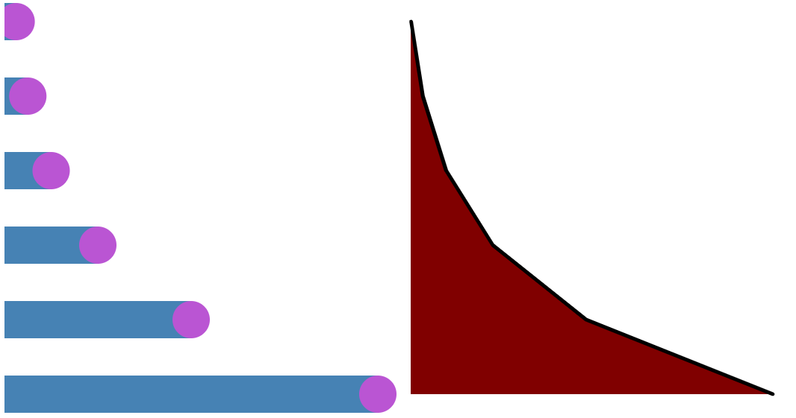

Assignment 1 - Hello World: GitHub and d3  
===

See: https://nyoma-diamond.github.io/01-ghd3/index.html

For the assignment, I created a horizontal bar graph representing the exponential growth of the equation 2^x. To show another way of visualizing this exponential growth I also created line chart, underneath which is filled using a polygon.

This is a screenshot of the visualization:



You'll see I tried to get the circles to align with the bars to cap them off smoothly. My hope was that this would make the image look just slightly cleaner while also giving me something functional to do with the circles. I also made sure to create the polygon *before* the line so that the line would be more visible (otherwise the polygon would render on top of the line, hiding part of it).

This has also been coded such that you may enter to what power you want to take 2^x to, so while my screenshot only shows up to 2^5, you can try up to as high as you want (though at higher values the bar graph will stop looking so good as the bars will overlap since their width is hard-coded).

---

This is a starting project to make sure you can write and host a webpage that generates graphics using d3. 

The primary goal is to be able to generate graphics primitives (circles, rectangles, lines, polygons) at different locations on the screen with different colors. 

The secondary goal is to introduce you to coding on GitHub, including creating a gh-pages branch to host your visualizations.

You may write everything from scratch, or start with demo programs from books or the web. 
If you do start with code that you found, you **must identify** the source of the code in your README and, most importantly, make non-trivial changes to the code to make it your own so you really learn what you're doing. 

For example, you could download one of the d3.js examples, read it through so you understand what it's doing, and then change the appearance of the graphical output to use different color schemes, different primitive shapes, different layouts of the primitives, and so on.

Resources
---

If you need a JavaScript/HTML/CSS refresher, see [JavaScript Codeacademy](https://www.codecademy.com/en/tracks/javascript) or find one of your choosing on the web.

If you need a Git/GitHub refreseher, some possible resources include [Getting Started with GitHub](https://help.github.com/categories/bootcamp/), the [GitHub Guides](https://guides.github.com/) (especially the ones on Hello World, and Understanding the GitHub Flow, and Forking Projects), and [CodeSchool's Try Git Course](https://www.codeschool.com/courses/try-git).

Requirements
---

1. Your project should contain at least four kinds of graphics primitives (circles, rectangles, lines, polygons) in different colors. 
2. Your document should identify the source of the code if you start with code that you found. 
3. Your code should be forked from the GitHub repo and linked using GitHub pages. See the "GitHub Details" section below for detailed instructions on how to do this.

GitHub Details
---

- Fork the GitHub Repository for Assignment 1. You now have a copy associated with your username.
- Make changes to index.html to fulfill the project requirements. 
- Make sure your "main" branch matches your "gh-pages" branch. See the GitHub Guides referenced above if you need help.
- Edit the README.md with a link to your gh-pages site "https://nyoma-diamond.github.io/01-ghd3/index.html".

Submission Details
---

- To submit, make a [Pull Request](https://help.github.com/articles/using-pull-requests/) on the original repository.
- Note: name your pull request using the following scheme: 

```
a1-your Gh username-your first name-your lastname

```

Vis Details
---

For this project you should use d3.js. 
You can learn from examples on the [d3.js](http://d3js.org) site or start from scratch.

See the [Using d3js](https://github.com/mbostock/d3/wiki#using) documentation for how to run your own local server.

Creative solutions are welcome! In the past I've seen recreations of paintings, interactives, and more.

Go beyond the minimum requirements of this project.
Experiment with other aspects of the [d3 API](https://github.com/mbostock/d3/wiki/API-Reference) and [d3 Tutorials](https://github.com/mbostock/d3/wiki/Tutorials). 
Try making the elements interactive, for example, or animate them.

Grading
---

Grades are on a 120 point scale. 
96 points will be graded for functionality: the program does what the assignment requests with an informative README. 

We will use Google Chrome to view submissions. 
Be sure to test your code there.

Below are some, but not necessarily all, of the key points we will consider during grading:

- Circles and Rectangles  
- Lines  
- Polygons  
- Different colors  
- README Quality
  - A description of what you have created. 1-2 screenshots are recommended for the README.  
  - A working link to the hosted files (usually the gh-pages 'live' url)  
  - Section for Technical and Design Achievements

Technical Achievement Desription -- 12  
Design Achievement Description -- 12

Remember, it is up to *you* to define what constitutes a technical and design achievements.
Be ambitious as these are designed to allow you to shape your learning.
These are the only way to move from B to A territory.
