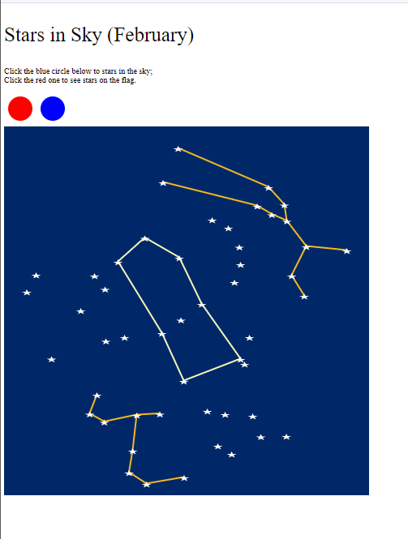

# Colby Frechette CS 4802 Assignment 1
My submission for CS 4802 a1 at Worcester Polytechnic Institute
# [Github Pages](https://colb131.github.io/)

# What did I create?
The nice man you will see is Oliver. Oliver lives in an abstract world with a sun separated by fission. Oliver is pretty shy, so let him know when you want to see his face by clicking on it. Also, Oliver is a skeptic, and likes to keep his house safe at night, by completely removing the door when he goes to bed. He only knows how to do this one way, by clicking on his roof.

P.S. Be careful of hovering over his body, as he is shy, remember.

# Technical Achievement
I went above and beyond in the technical aspect by creating moving objects using d3 as well as objects that change color, and opacity when interacted with by the user.

# Design Achievement
I decided to be a little creative and add some spunk with Oliver and the sun and his house of varying colors.

Here's some amazing pictures of Oliver and his world!

